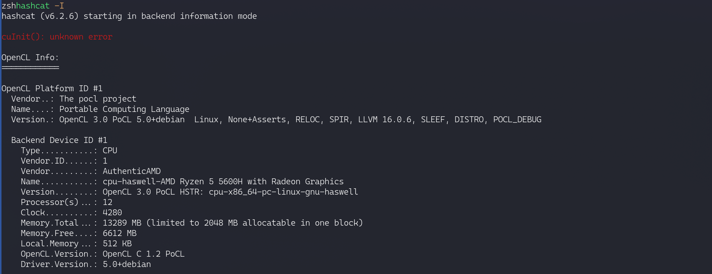
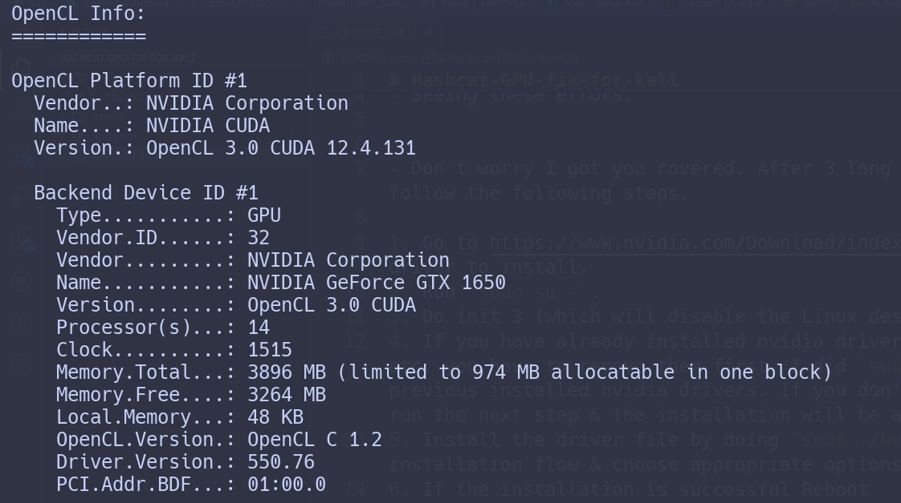

# Hashcat-GPU-fix-for-kali
My solution for `Hashcat` not detecting NVIDIA GPU for hybrid graphics setup.

## My System
`AMD Radeon vega` + `nvidia 1650`.

- Hashcat is not detected integrated GPU and seeing these errors even after doing `sudo apt-get dist-upgrade or apt-get full-upgrade`



- Don't worry I got you covered. After 3 long years I have finally solved this issue. Just follow the following steps.

1. Go to https://www.nvidia.com/Download/index.aspx?lang=en-us & select your proper GPU driver to install.
2. Run `sudo su -`. 
3. Do `init 3` (which will disable the Linux desktop and switch to a text interface.).
4. If you have already installed nvidia drivers using a package manager like `apt`, `nala` etc. you have to remove them first. I did `sudo apt remove nvidia*` which removed all of the previous installed nvidia drivers. If you don't do this you'll get a warning when you try to run the next step & the installation will be aborted.
5. Install the driver file by doing `sudo ./Nvidia-<your version>.run`. Follow the installation flow & choose appropriate options. 
6. If the installation is successful Reboot

- Now run `hashcat -I` & if everything goes well you would be able to see something like this. 



- Now it's not over yet. After following this my laptop display goes dark and only external monitor display was visible as this was expected because of the new updated drivers the system will use the `dedicated GPU` i.e. `nvidia` one for as the primary graphics driver. Now in order to fix this thanks for `hackterr` on discord you can either set your laptop display card to `nvidia` or `integrated AMD` GPU for `laptop display` & keep the `nvidia` one for external display. I choose the later one.
- Add the following your `/etc/X11/xorg.conf` file. (You need `sudo` to edit this)

```sh
Section "Device"
    Identifier     "Device1"
    Driver         "modesetting"
    VendorName     "Advanced Micro Devices"
    BusID          "PCI:5:00.0" # run lspci | grep -i vga to see your bus ID for integrated GPU. In my case it was 5:00.0
EndSection
```
- If anyone is interested I'm attaching my [xorg.conf](./xorg.conf) file in this repo.

- If your external display goes dark after every kali update then run this [script](https://github.com/Aviksaikat/Hybrid-Graphics-Setup). It has been successful for the past 3 years & I ran it just now while writing this README :).